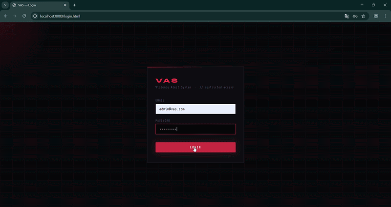
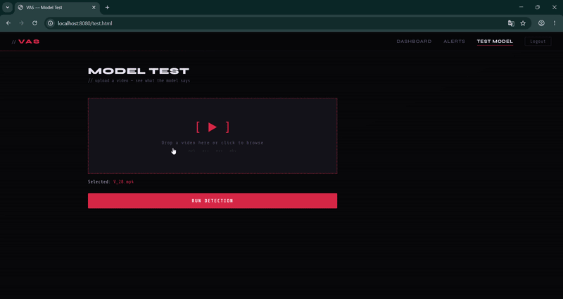
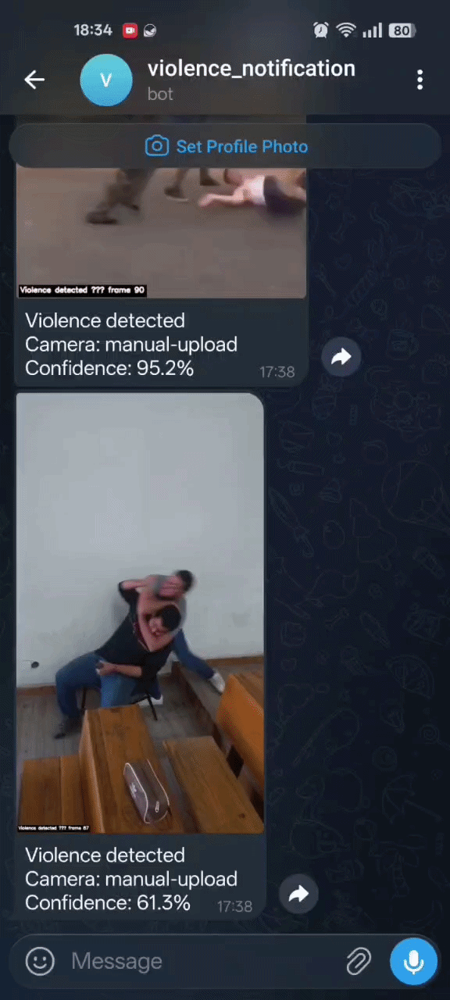
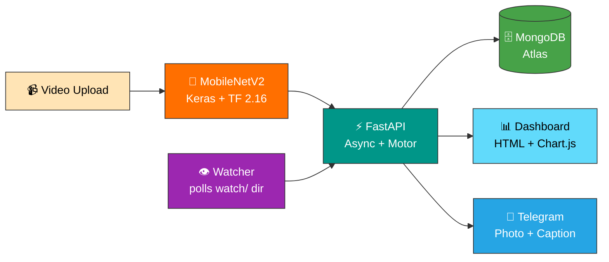

<div align="center">

# Violence Alert System

**Async ML backend with JWT auth, audit logging, and instant Telegram alerts**

[](https://www.python.org/)
[](https://fastapi.tiangolo.com/)
[](https://www.mongodb.com/atlas)
[](https://www.tensorflow.org/)
[](https://core.telegram.org/bots)
[](https://jwt.io/)
[](https://prometheus.io/)

> End-of-year internship at the Faculty of Sciences and Technologies of Marrakech · ISGA · Jul – Aug 2024

</div>

---

## 🎯 What it does

A MobileNetV2 violence detection model wrapped in a production FastAPI service. You upload a video. The model runs inference. If violence is detected, a snapshot is pulled from that frame and pushed to Telegram with the photo attached. Every step gets logged.
Security and observability weren't bolted on at the end: JWT rotation, rate limiting, audit trail, structured logs, Prometheus metrics.

---

## 🖥️ App walkthrough

<div align="center">



*Login → dashboard with live stats → alerts table → alert detail → mark as reviewed.*

</div>

---

## ⚡ Detection flow

<div align="center">

<table>
<tr>
<td align="center" width="560">

**Drop a video → get a result**



</td>
<td align="center" width="340">

**Telegram alert fires automatically**



</td>
</tr>
</table>

</div>

*Inference runs on the uploaded video. If violence is detected, a snapshot is extracted and pushed to Telegram in under 2 seconds.*

> On phones, the table overflows the viewport and GitHub wraps it in a horizontal scroll. Swipe left/right to see the full detection flow and the Telegram alert at proper size.

---

## 🧰 Tech stack

| Layer | Technology |
|---|---|
| 🤖 **AI** | MobileNetV2 (Keras) · TensorFlow 2.16 · OpenCV · NumPy |
| ⚡ **Backend** | FastAPI 0.111 · Motor 3.4 (async MongoDB) · Pydantic v2 |
| 🔐 **Auth** | JWT access (15 min) + refresh (7 days) · bcrypt cost 12 · slowapi |
| 🗄️ **Database** | MongoDB Atlas M0 · 4 indexes · 365-day TTL on audit log |
| 🔔 **Alerts** | Telegram Bot API · async httpx · 3-attempt retry + backoff |
| 📊 **Observability** | Structured JSON logs · request-id middleware · Prometheus `/metrics` |
| 🖥️ **Frontend** | HTML5 · Vanilla JS · Chart.js (no framework) |

---

## 🏗️ Architecture



---

## 🚀 Quick start

### Prerequisites

- Python 3.11
- MongoDB Atlas M0 (free tier)
- Telegram bot token from [@BotFather](https://t.me/BotFather)

### 1️⃣ Clone and set up

```bash
git clone https://github.com/Nizar7kabbaj/violence-alert-system.git
cd violence-alert-system/backend
python -m venv venv
venv\Scripts\activate        # Windows PowerShell
pip install -r requirements.txt
```

### 2️⃣ Configure

Copy `.env.example` to `.env` and fill in:

```env
MONGODB_URI=mongodb+srv://<user>:<pass>@<cluster>/vas?retryWrites=true&w=majority
MONGODB_DB_NAME=vas
JWT_SECRET=<random 64-byte hex>
JWT_REFRESH_SECRET=<random 64-byte hex, different>
TELEGRAM_BOT_TOKEN=<from @BotFather>
TELEGRAM_CHAT_ID=<your chat id>
INTERNAL_API_KEY=<random 64-byte hex>
CORS_ALLOWED_ORIGINS=http://localhost:8080
```

### 3️⃣ Seed and run

```bash
# Create the admin account
python scripts/seed_admin.py

# Start the backend
uvicorn app.main:app --reload

# Serve the UI (separate terminal, from ui/)
python -m http.server 8080
```

Open `http://localhost:8080/login.html`.

> The model file (`modelnew.h5`) goes in `backend/models/`. Download it separately. It's not tracked in Git.

---

## 🔐 Security posture

| Layer | What's in place |
|---|---|
| Passwords | bcrypt cost 12, timing-safe login check |
| Sessions | JWT access (15 min) + refresh (7 days), rotation + reuse detection |
| Rate limiting | 5/min on `/login` · 10/min per user on `/detect` |
| Browser hardening | HSTS · X-Frame-Options DENY · nosniff · CSP · Referrer-Policy |
| File uploads | Magic-byte validation · content-type whitelist · path-traversal protection |
| Service calls | `X-Internal-API-Key` for watcher → backend |
| Audit trail | Every state change logged, 365-day TTL |
| Threat model | STRIDE — every threat marked mitigated, partial, accepted, or deferred |

---

## 📊 Performance numbers

| Metric | Result |
|---|---|
| ML inference (CPU, warm) | **5.66 FPS** |
| Load test — `/health` p95 | **< 20 ms** (50 users, 60 s) |
| Load test — `/alerts` p95 | **< 90 ms** |
| Telegram alert latency | **< 2 s** end-to-end |
| DB connection pool | `maxPoolSize=50`, `minPoolSize=10` |

Full results in [`docs/performance/`](docs/performance/).

---

## 📁 Repository structure

```
violence-alert-system/
├── 🔐 backend/
│   ├── app/
│   │   ├── core/          # config, limiter, metrics, security
│   │   ├── api/           # auth, alerts, detect, audit, metrics
│   │   ├── middleware/    # request_id, security_headers
│   │   ├── ml/            # detector.py — model loads once at startup
│   │   ├── services/      # telegram.py
│   │   └── workers/       # watcher.py — polls watch/ every 10s
│   └── scripts/           # seed_admin.py
├── 🖥️  ui/                 # login, dashboard, alerts, alert-detail
├── 📈 scripts/             # locustfile.py, benchmark-inference.py
└── 📖 docs/
    ├── model-limitations.md
    ├── alerting-limitations.md
    └── security/
        └── threat-model.md
```

---

## 📅 Roadmap

| Phase | Scope | Status |
|---|---|---|
| 1️⃣ | FastAPI bootstrap · MongoDB Atlas · health endpoint | ✅ Done |
| 2️⃣ | JWT auth · rate limiting · security headers · CORS | ✅ Done |
| 3️⃣ | ML inference · Telegram alerts · watcher worker | ✅ Done |
| 4️⃣ | Dashboard UI · audit log · mark-as-reviewed flow | ✅ Done |
| 5️⃣ | Structured logs · Prometheus metrics · load tests · STRIDE | ✅ Done |

---

## 🎓 What I learned

This was my first time building a backend where security wasn't optional. A few things that stuck:

- **JWT refresh rotation** — the attack surface is bigger than most tutorials admit. Reuse detection matters.
- **Async all the way** — mixing sync DB calls into an async FastAPI app breaks under load. Motor keeps it clean.
- **STRIDE threat modeling** — naming threats explicitly, then deciding whether to mitigate or accept, is more useful than a generic checklist.
- **Honest measurement** — Locust numbers over localhost benchmarks. Real latency from Marrakesh to Atlas (~50–60 ms RTT) went into the docs, not a footnote.
- **Keras 3 / TF 2.16 compatibility** — debugging a model trained on TF 2.8 in a newer runtime taught me more about the framework internals than any tutorial.

**Skills I came out with:**

`FastAPI` · `Motor / MongoDB` · `JWT auth` · `slowapi` · `TensorFlow / Keras` · `OpenCV` · `Prometheus` · `Locust` · `STRIDE` · `Telegram Bot API` · `Pydantic v2` · `structured logging` · `async Python`

---

## 🙏 Acknowledgements

**Mme. Rahil Imane** — my supervisor at FSTG Marrakech. Her feedback pushed me to document limitations honestly rather than hide behind accuracy numbers. That discipline shaped how I write about technical work.

**Pr. Layla Wakrim** — my professor at ISGA Marrakech. She taught me to think about a project as a whole: the framing, the story, what matters and what doesn't. Not just the code that runs.

Thank you both.

---

## ⚠️ Honest limitations

The model was trained on 700 videos at 128×128. It works, but it's not ready for real deployments without a larger dataset and higher resolution input.

Telegram is fast and practical for development. It's not a production alerting channel: no delivery guarantees, no SIEM integration.

Both are documented in full: [`docs/model-limitations.md`](docs/model-limitations.md) · [`docs/alerting-limitations.md`](docs/alerting-limitations.md)

---

## 👤 Author

**Nizar Kabbaj** — End-of-year internship at FSTG Marrakech · ISGA · 2024
🔗 GitHub: [@Nizar7kabbaj](https://github.com/Nizar7kabbaj)

---

<div align="center">

⭐ If this project was useful to you, a star on the repo is appreciated.

</div>
