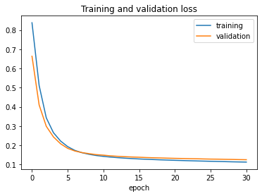
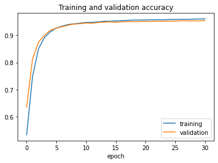
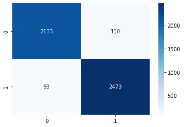

# Model Limitations

This document describes what the violence detection model can and cannot do. It is part of the project's honesty documentation.

---

## What the model is

MobileNetV2 trained as a binary classifier: violence vs. non-violence. The backbone weights come from ImageNet pretraining. Only the final Dense layer was trained; all MobileNetV2 layers were frozen. The model outputs a single sigmoid score. A detection is flagged as violence when that score exceeds the configured threshold (default 0.85).

---

## Training data

- **Source:** Real Life Violence Dataset (Kaggle)
- **Videos used:** 700 out of 2,000 available — 350 violence, 350 non-violence. The rest were dropped due to memory constraints during training.
- **Frames:** Each video was sampled at every 7th frame with augmentation (horizontal flip, brightness jitter, zoom ±30%, rotation ±25°), producing 16,030 frames total.
- **Resolution:** All frames resized to 128×128 RGB before training.
- **Split:** 70% train / 30% test, stratified by class.

The dataset covers short clips from surveillance cameras, sports footage, and street videos. It does not cover all environments or camera angles.

---

## Measured performance

Evaluated on the held-out test split (4,809 frames):

| Metric | Non-Violence | Violence |
|---|---|---|
| Precision | 0.96 | 0.96 |
| Recall | 0.95 | 0.96 |
| F1-score | 0.95 | 0.96 |

Overall accuracy: **95.8%** (4,606 correct / 203 wrong).

Training converged at epoch 31. Train accuracy at that epoch: 96.2%. These numbers come from the training notebook and have not been verified on an independent dataset.

### Loss curve

### Accuracy curve

### Confusion matrix

---

## What the model does not do

**No cross-dataset evaluation.** Performance was measured only on a held-out portion of the same dataset used for training. How it generalises to different camera types, lighting conditions, or locations is unknown.

**No per-person detection.** The model classifies the full frame. It cannot localise who is involved or track individuals across frames.

**Low input resolution.** 128×128 is small. Fine-grained motion — a partial obstruction, a hand gesture — can disappear at this resolution.

**Frame-level decisions, not clip-level.** The backend samples 16 frames and flags violence if any frame exceeds the threshold. One ambiguous frame can trigger a false positive. Violence that falls outside the sampled frames produces a false negative.

**No audio.** The model sees pixels only. Verbal threats, screams, and other audio cues are ignored.

**Frozen backbone.** The MobileNetV2 weights were not fine-tuned on this task. The backbone was trained on ImageNet object recognition. Only the final Dense layer learned from the violence dataset.

**CPU-only inference.** Inference on a typical clip takes several seconds. The system is not suitable for real-time video streams.

---

## What this means in practice

A score above the threshold is a signal to review, not a confirmed incident. False positives and false negatives both occur. The system is built for human-reviewed alerting, not autonomous decision-making.

The 0.85 threshold is configurable. Raising it reduces false positives at the cost of missing more real incidents. Lowering it catches more incidents at the cost of more noise. The right value depends on who is reviewing the alerts and how often.

---

## What production use would require

- Evaluation on at least one independent dataset not seen during training
- Temporal aggregation across frames rather than per-frame flagging
- Higher input resolution and a fine-tuned backbone
- Localisation of individuals involved
- Audio integration
- GPU inference for live feeds
- Ongoing monitoring of precision and recall in the target environment